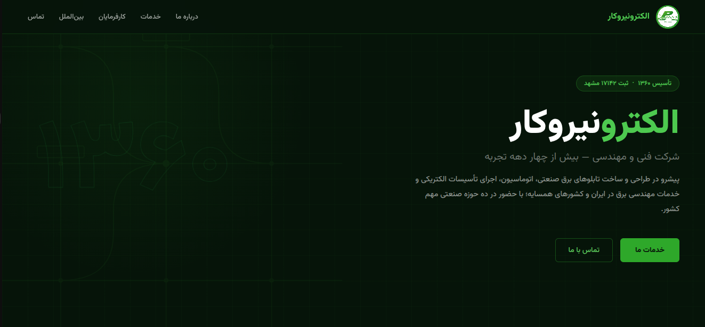

# Electro Niro Kar

A responsive Persian (RTL) corporate website for **Electro Niro Kar**, an electrical engineering and industrial services company.

## Live Demo

The live Vercel URL will be added here after deployment:

**Live Website:**

[View Live Website](https://electro-niro-kar.vercel.app)
<!-- After deployment, replace "Coming soon" with your Vercel URL, for example:
https://electro-niro-kar.vercel.app
-->

## Preview

A website screenshot can be added here after deployment or after capturing the final version:

```markdown

```

> Add the screenshot as `assets/images/preview.png`, then uncomment or add the Markdown image line above.

## Features

- Responsive single-page design
- Persian and RTL layout
- Modern green corporate theme
- Animated circuit-style hero background
- Company services section
- Statistics and company achievements
- International projects section
- Certifications and team information
- Contact information
- Mobile-friendly layout
- Ready for GitHub and Vercel deployment

## Tech Stack

- HTML5
- CSS3
- Responsive Design
- RTL Layout
- Vazirmatn Font

## Project Structure

```text
electro-niro-kar/
├── index.html
├── css/
│   └── styles.css
├── assets/
│   └── images/
│       ├── logo.jpg
│       └── preview.png
├── .gitignore
├── LICENSE
├── README.md
└── vercel.json
```

## Run Locally

No build step is required because this is a static HTML and CSS website.

You can open `index.html` directly in your browser, or run a local development server:

```bash
python3 -m http.server 8000
```

Then open:

```text
http://localhost:8000
```

## Deploy to GitHub

Create a new GitHub repository, then run:

```bash
git init
git add .
git commit -m "Initial website setup"
git branch -M main
git remote add origin https://github.com/YOUR_USERNAME/electro-niro-kar.git
git push -u origin main
```

Replace `YOUR_USERNAME` with your GitHub username.

## Deploy to Vercel

1. Push the project to GitHub.
2. Sign in to Vercel.
3. Select **Add New Project**.
4. Import the GitHub repository.
5. Set **Framework Preset** to **Other**.
6. Leave the Build Command and Output Directory empty.
7. Click **Deploy**.
8. Copy the generated Vercel URL and add it to the **Live Demo** section of this README.

## Adding a Website Preview

After the final version is ready:

1. Take a screenshot of the website.
2. Save it as:

```text
assets/images/preview.png
```

3. Add this line under the **Preview** section:

```markdown

```

GitHub will automatically display the screenshot inside the README.

## License

All Rights Reserved.

The source code and website content are proprietary unless otherwise stated. Unauthorized copying, modification, distribution, or commercial use is prohibited.
